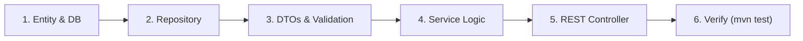

# TrekBook VN - Backend Development Workflow & Procedures

Tài liệu hướng dẫn quy trình chuẩn (Runbook / SOP) dành cho AI và kỹ sư khi phát triển tính năng mới tại phân hệ `backend/`.

---

## 1. Quy Trình 6 Bước Chuẩn Khi Thêm Tính Năng Mới

1. **Entity:** Tạo Entity kế thừa `BaseAuditEntity` trong `com.trekhub.entity`. Thêm index và annotation JPA phù hợp.
2. **Repository:** Tạo interface trong `com.trekhub.repository` kế thừa `JpaRepository` hoặc `JpaSpecificationExecutor`. Luôn nhận `Pageable` cho danh sách.
3. **DTOs & Mapper:** Tạo Request/Response DTO trong `com.trekhub.dto`. Định nghĩa validation (`@NotBlank`, `@NotNull`). Map bằng MapStruct.
4. **Service:** Tạo interface tại `com.trekhub.service` và implementation tại `com.trekhub.service.impl`. Đặt `@Transactional(readOnly = true)` ở class level và `@Transactional` cho các method thay đổi dữ liệu.
5. **Controller:** Tạo endpoint tại `com.trekhub.controller` với `@RestController` và `@RequestMapping("/api/v1/...")`. Trả về `ResponseEntity<ApiResponse<T>>`. Thêm Swagger `@Operation`.
6. **Kiểm tra:** Chạy `mvn compile` hoặc `mvn test` để đảm bảo không lỗi cú pháp.

---

## 2. Quy Trình Xử Lý Nghiệp Vụ Chuyên Biệt

### 2.1. Đăng Tải Album Ảnh Kỷ Niệm (Media Upload)
- Client upload ảnh lên CDN (Cloudinary / AWS S3) $\rightarrow$ gửi mảng `List<String> mediaUrls` về backend trong `CreatePostRequest`.
- Backend lưu danh sách ảnh vào `@ElementCollection` hoặc bảng liên kết `post_media`.

### 2.2. Thuật Toán Xác Thực Chạm Đỉnh (Summit Verification)
- Khi bài viết có đính kèm GPS tọa độ hoặc GPX track:
  - Tính khoảng cách Haversine giữa tọa độ của User và tọa độ đỉnh chóp của `Trail`.
  - Nếu khoảng cách $\le 200\text{m}$, tự động set `isSummitVerified = true`.
  - Kích hoạt sự kiện cấp huy hiệu tương ứng trong Hộ chiếu leo núi (`UserBadge`).

### 2.3. Bảng Tin Mạng Xã Hội (Social Feed Cursor Pagination)
- Sắp xếp mặc định: `createdAt DESC`.
- Hỗ trợ lấy theo:
  - Bảng tin chung (Global Feed)
  - Bảng tin bạn bè đang theo dõi (Following Feed)
  - Bảng tin theo đỉnh núi cụ thể (`taggedTrailId`)
