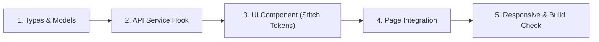

# TrekBook VN - Frontend Development Workflow & Procedures

Tài liệu hướng dẫn quy trình chuẩn (Runbook / SOP) dành cho AI và kỹ sư khi phát triển tính năng tại phân hệ `client/`.

---

## 1. Quy Trình 5 Bước Khi Phát Triển Một Component / Trang Mới



### Bước 1: Khai báo TypeScript Types
- Đặt tại `src/types/`.
- Định nghĩa rõ ràng kiểu dữ liệu cho bài viết (`Post`), người dùng (`User`), cung đường (`Trail`), phản hồi API (`ApiResponse<T>`).
- Tuyệt đối không dùng kiểu `any`.

### Bước 2: Viết API Client Function & React Hook
- Đặt tại `src/services/` và `src/hooks/`.
- Sử dụng Axios instance đã cấu hình sẵn JWT Interceptor.
- Bọc bằng React Query (`useQuery` hoặc `useInfiniteQuery`) để cache dữ liệu bảng tin, tránh gọi API trùng lặp.

### Bước 3: Phát triển UI Component theo Stitch Design System
- Đặt tại `src/components/`.
- Sử dụng màu sắc và class Tailwind theo tokens (Deep Forest Green `bg-[#1B4332]`, Terracotta `text-[#D97736]`, Sand `bg-[#F6FBF4]`).
- Đảm bảo tương thích Dark/Light theme nếu có.

### Bước 4: Tích hợp vào Trang (App Router)
- Đặt tại `src/app/`.
- Áp dụng Server Components cho nội dung tĩnh/SEO ban đầu, kết hợp Client Components (`'use client'`) cho các khối tương tác (Kudos, Comment, Modal tạo bài).

### Bước 5: Kiểm tra Responsive & Build
- Kiểm tra giao diện ở 3 kích thước màn hình:
  - Mobile: `< 768px` (Icon nav chuyển thành Bottom Nav Bar).
  - Tablet: `768px - 1023px`.
  - Desktop: `≥ 1024px` (Top Header Icon Nav trung tâm + Bố cục 3 cột).
- Chạy lệnh kiểm tra TypeScript và Build:
  ```powershell
  npm run build
  # hoặc
  npm run lint
  ```

---

## 2. Quy Trình Tạo Bài Viết Kỷ Niệm (Post Creation Flow)

1. Người dùng bấm nút `+ Đăng bài` trên Header hoặc ô chia sẻ kỷ niệm ở giữa Feed.
2. Mở Modal `CreatePostModal`:
   - Nhập cảm xúc, câu chuyện chuyến đi (`caption`).
   - Chọn ảnh từ máy tính $\rightarrow$ Preview ảnh ngay tức thì.
   - Gắn thẻ Đỉnh núi (`TrailPickerDropdown`).
   - Nhập thông số cự ly, độ dốc hoặc đính kèm file GPX.
3. Bấm **Đăng bài**:
   - Gửi ảnh lên backend/Cloudinary.
   - Nhận lại URL ảnh và gọi API `POST /api/v1/posts`.
   - Cập nhật bài viết mới lên đầu Feed mà không cần reload trang (Optimistic UI update).
